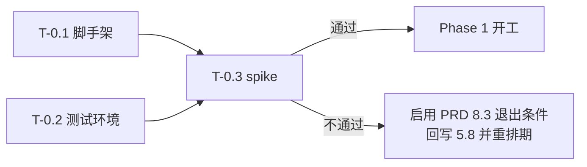

# VSCode WebDAV 工作区扩展 - 开发计划

> 版本：v1.0 ｜ 最后更新：2026-09-03
> 配套文档：[需求规格说明书 (PRD) v1.2](./requirements.md)
> 说明：本文所有任务均标注对应的 PRD 需求编号（FR-x.x / NFR-x.x）。工作量单位为**人天**，按 1 名熟悉 TypeScript 与 VSCode 扩展开发的工程师估算。

---

## 1. 技术选型

| 领域 | 选型 | 依据 |
| :--- | :--- | :--- |
| 语言 | TypeScript 5.x，`strict: true` | — |
| 目标运行时 | Node.js 扩展宿主，`engines.vscode >= 1.75.0` | NFR-3.2、NFR-3.3（仅 Desktop） |
| 打包 | esbuild（`--bundle --platform=node --format=cjs --external:vscode`） | PRD 5.8.2 |
| HTTP 传输 | **自研**，基于 `node:https` / `node:http` | PRD 8.3 决议，设计见 PRD 5.8 |
| XML 解析 | `fast-xml-parser`（**唯一运行时依赖**） | PRD 5.8.3 |
| 单元测试 | Vitest（协议层为纯 Node 模块，无需 Electron） | NFR-4.1、NFR-4.2 |
| 集成测试 | `@vscode/test-cli` + `@vscode/test-electron` | 覆盖 FSP 与 UI 层 |
| 测试服务端 | Docker Compose：Nextcloud、Apache `mod_dav`、Nginx + `dav-ext` | PRD 5.6 兼容性矩阵 |
| 代码规范 | ESLint + Prettier | — |
| CI | GitHub Actions（lint / unit / integration / package） | — |
| 发布 | `@vscode/vsce` | — |

**依赖红线**：运行时依赖仅允许 `fast-xml-parser`。新增任何运行时依赖需在 PR 中说明理由，因其直接影响 PRD 5.8.2 声称的供应链与体积收益。

---

## 2. 代码结构

分层严格遵循 NFR-4.1：`src/webdav/**` 与 `src/connection/store.ts` 之外的协议逻辑**不得 `import 'vscode'`**，由 ESLint 规则强制。

```text
src/
  extension.ts              激活入口。同步注册 provider（PRD 5.2 硬约束）
  webdav/                   ── 协议层：纯 Node，零 vscode 依赖，可独立单测
    types.ts                WebdavClient 接口、Stat、ClientOptions
    path.ts                 路径编码/解码、href 归一化、尾斜杠处理（PRD 5.3）
    request.ts              【单一 HTTP 出口】认证/超时/取消/Agent/日志/进度/并发队列
    propfind.ts             PROPFIND 请求构造 + multistatus 解析
    client.ts               8 个动作的实现：propfind/get/put/mkcol/delete/move/copy/options
    errors.ts               HTTP 状态 → WebdavError
    auth/
      basic.ts  digest.ts  bearer.ts
  connection/
    types.ts                ConnectionConfig
    store.ts                连接配置 CRUD（globalState）
    secrets.ts              SecretStorage 封装（FR-1.2）
    resolver.ts             connectionId → WebdavClient（懒加载 + 实例缓存，PRD 5.2）
  fs/
    provider.ts             WebdavFileSystemProvider
    cache.ts                元数据缓存与失效模型（PRD 5.4）
    errorMap.ts             WebdavError → vscode.FileSystemError（FR-4.2）
  ui/
    commands.ts  tree.ts  quickpick.ts  statusBar.ts  connectionEditor.ts
  log/
    channel.ts              OutputChannel + 脱敏（FR-6.1）

test/
  unit/                     Vitest：协议层、路径编码、缓存、错误映射
  integration/              @vscode/test-cli：FSP 端到端
  compat/                   兼容性冒烟用例集（PRD 5.6）
docker/
  compose.yml               本地/CI 测试服务端
```

---

## 3. 阶段任务拆解

### Phase 0：工程基建与技术验证（约 4 人天）

> **本阶段是决策门，未通过不得进入 Phase 1。**

| ID | 任务 | 对应需求 | 估时 | 交付物 / 验收标准 |
| :--- | :--- | :--- | :--- | :--- |
| T-0.1 | 仓库脚手架：TS + esbuild + ESLint（含"协议层禁止 import vscode"规则）+ Vitest + GitHub Actions | — | 1.0 | `npm run build` 产出可加载的 CJS bundle；CI 全绿 |
| T-0.2 | Docker Compose 测试环境：Nextcloud、Apache `mod_dav`（开 Digest）、Nginx + `dav-ext` | NFR-3.1 | 1.0 | `docker compose up` 后三个服务端均可用 curl 完成 PROPFIND |
| T-0.3 | **协议层 spike**：`PROPFIND Depth:1`（含中文/空格/`#` 文件名）→ `GET` → `PUT`，对 Nextcloud 与 `mod_dav` 各跑通 | PRD 5.8.4 | 2.0 | 两个服务端全部通过；产出 href 格式差异记录 |

**Phase 0 决策门**：T-0.3 通过 → 维持自研方案；未通过 → 启动 PRD 8.3 退出条件（改用 `webdav@5` + esbuild），并回写 PRD 5.8。



---

### Phase 1：MVP（v0.1.0，约 12.5 人天）

**目标**：能配置一个连接、输入远程路径打开工作区、浏览目录、打开并保存文件。

| ID | 任务 | 对应需求 | 估时 | 依赖 | 验收标准 |
| :--- | :--- | :--- | :--- | :--- | :--- |
| T-1.1 | `path.ts`：段级编码、href 归一化与解码、尾斜杠统一、路径穿越防御 | PRD 5.3、NFR-2.5 | 1.5 | T-0.3 | 单测覆盖空格/中文/`#`/`?`/`&`/`+`/`%`/`..`，覆盖率 ≥ 90% |
| T-1.2 | `request.ts` 单一出口：Basic 认证、超时、取消、按连接 `https.Agent`、日志钩子 | FR-1.5 P0、NFR-1.5、NFR-2.3 | 2.0 | T-0.3 | 自签名证书仅对该连接放行；全局 TLS 开关未被修改 |
| T-1.3 | `propfind.ts`：请求构造 + multistatus 解析 + **过滤自身条目** | FR-3.2 | 1.5 | T-1.1 | 三个服务端的真实响应样本均解析正确 |
| T-1.4 | `client.ts`：MVP 动作 `propfind` / `get` / `put` / `options` | FR-3.1~3.4 | 1.0 | T-1.2, T-1.3 | — |
| T-1.5 | `errors.ts` + `fs/errorMap.ts`：401/403/404/超时四类 | FR-4.2 | 0.5 | T-1.2 | 单测覆盖四类映射 |
| T-1.6 | `connection/`：配置 CRUD + SecretStorage + resolver 懒加载 | FR-1.1、FR-1.2 | 1.0 | — | 凭据不落 `settings.json`；凭据缺失时抛可识别错误 |
| T-1.7 | `extension.ts`：`onFileSystem:webdav` 激活事件 + **同步注册 provider** | PRD 5.2 | 0.5 | T-1.6 | 注册耗时 < 50ms（NFR-1.4）；`await` 之前完成注册 |
| T-1.8 | `fs/provider.ts`：`stat` / `readDirectory` / `readFile` / `writeFile`（含 `{create, overwrite}` 边界） | FR-3.1~3.4 | 2.0 | T-1.4, T-1.7 | 新建文件、另存为、覆盖保存行为正确 |
| T-1.9 | 命令：新增连接、输入远程路径并打开工作区 | FR-1.1、FR-2.1 简化版 | 1.0 | T-1.6 | 重载后资源管理器正常展现目录树 |
| T-1.10 | `log/channel.ts`：OutputChannel + 强制脱敏 | FR-6.1 | 0.5 | T-1.2 | 单测断言日志中不含密码/`Authorization` 明文 |
| T-1.11 | `package.json` 能力声明（`virtualWorkspaces` / `untrustedWorkspaces` / 无 `browser` 入口）+ 打包本地安装验证 | PRD 2.4、NFR-3.3 | 0.5 | 全部 | VSIX 可安装并完成一次完整读写 |

**Phase 1 Definition of Done**
- 在 Nextcloud 与 `mod_dav` 上完成：打开工作区 → 浏览含中文/空格文件名的目录 → 打开文件 → 修改 → `Cmd+S` 保存成功 → 服务端内容已更新。
- 断网、401、404 三种异常均有明确提示，编辑器不卡死。
- 单测覆盖率：`src/webdav/**` ≥ 70%（NFR-4.2）。

---

### Phase 2：交互与体验完善（v0.2.0，约 14 人天）

| ID | 任务 | 对应需求 | 估时 | 验收标准 |
| :--- | :--- | :--- | :--- | :--- |
| T-2.1 | `fs/cache.ts`：TTL 缓存 + `readDirectory` 回填子项 stat + 写操作同步失效 | NFR-1.1 | 2.0 | 展开目录后逐个 `stat` 不再产生网络请求 |
| T-2.2 | in-flight 请求合并（同路径并发去重） | NFR-1.2 | 0.5 | 并发 20 次 `stat` 同路径仅发 1 个请求 |
| T-2.3 | 补全 FSP：`createDirectory` / `delete` / `rename` / `copy` / `watch` no-op 语义 | FR-3.5~3.9 | 2.0 | `COPY` 返回 405/501 时正确回退为 read+write |
| T-2.4 | QuickPick 层级目录导航（展开/返回上级/选择当前/手动输入跳转） | FR-2.1 | 1.5 | — |
| T-2.5 | TreeView 侧边栏面板 + 上下文菜单（当前窗口/新窗口/加入工作区/复制路径） | FR-2.2 | 2.5 | — |
| T-2.6 | 连接测试与列表管理（编辑/重命名/删除/复制，删除时清理凭据） | FR-1.3、FR-1.4 | 1.5 | 测试连接能区分 401/403/404/证书错误/超时 |
| T-2.7 | 最近打开历史（不含凭据） | FR-2.3 | 0.5 | 历史记录中无任何敏感信息 |
| T-2.8 | 刷新命令 + TreeView 刷新按钮（按子树失效缓存） | FR-2.4 | 0.5 | 外部修改后刷新即可见 |
| T-2.9 | 状态栏指示器 + 首次打开能力提示（可"不再提示"） | FR-4.3、FR-4.5 | 1.0 | — |
| T-2.10 | **兼容性矩阵首轮实测**，回写 PRD 5.6 全部"待验证"格 | NFR-3.1 | 2.0 | 6 个服务端 × 7 步冒烟用例全部执行并记录结论 |

**待决策项关闭点**：Phase 2 开工前须关闭 PRD **8.1.1（大小写敏感性）**——它决定 `registerFileSystemProvider` 的注册参数，改动成本随开发推进快速上升。**8.1.2（多根工作区）** 须在 T-2.5 前关闭。

---

### Phase 3：健壮性与高级功能（v0.3.0，约 13.5 人天）

| ID | 任务 | 对应需求 | 估时 | 验收标准 |
| :--- | :--- | :--- | :--- | :--- |
| T-3.1 | 传输进度通知 + 取消 + 大文件阈值保护（默认 50MB） | FR-4.1、FR-3.3、PRD 5.5 | 1.5 | 超阈值文件明确拒绝并说明原因，不 OOM |
| T-3.2 | ETag / `If-Match` 冲突检测与 412 三选一处理 | FR-4.4 | 1.5 | 模拟并发修改可稳定触发冲突面板 |
| T-3.3 | 401 重认证流程 + 请求重试 | FR-1.2、FR-4.2 | 1.0 | 密码过期后引导重输，不反复弹窗 |
| T-3.4 | Digest 与 Bearer 认证 | FR-1.5 P1 | 2.0 | `mod_dav` + Digest 环境端到端通过 |
| T-3.5 | 代理支持（继承 `http.proxy`，按连接可覆盖） | FR-1.6 | 1.0 | — |
| T-3.6 | 并发上限队列 + 同文件写串行化 | NFR-1.3 | 1.0 | 单连接并发请求数不超过配置值 |
| T-3.7 | 性能基准脚本 + NFR-1.4 五项指标达标验证 | NFR-1.4 | 1.0 | 1000 项目录 P95 < 2s 等五项全部达标 |
| T-3.8 | Webview 连接管理面板（含 URL 一键解析、服务端预设模板） | FR-1.1 增强 | 3.0 | — |
| T-3.9 | 按文件名查找（递归 PROPFIND，限深度与条目数）+ 全文搜索不支持提示 | FR-5.1 v1.0 方案 | 1.5 | 搜索入口不再静默无结果 |

---

### Phase 4：长尾与增强（v0.4.0+，约 3.5 人天）

| ID | 任务 | 对应需求 | 估时 |
| :--- | :--- | :--- | :--- |
| T-4.1 | 自定义请求头 | FR-1.5 P2 | 1.0 |
| T-4.2 | 只读连接（`isReadonly` 注册） | FR-1.7 | 0.5 |
| T-4.3 | 可选目录轮询刷新（默认关闭） | FR-3.9 P2 | 1.0 |
| T-4.4 | 全文搜索接入（视 proposed API 状态，可能不启动） | FR-5.1 v2.0 | 1.0 |

---

## 4. 排期汇总

| 阶段 | 工作量 | 单人周期 | 产出 |
| :--- | :--- | :--- | :--- |
| Phase 0 | 4.0 人天 | 第 1 周 | 技术方案确认 |
| Phase 1 | 12.5 人天 | 第 2–4 周 | v0.1.0（内部可用） |
| Phase 2 | 14.0 人天 | 第 5–7 周 | v0.2.0（Marketplace 首发） |
| Phase 3 | 13.5 人天 | 第 8–10 周 | v0.3.0（生产可用） |
| Phase 4 | 3.5 人天 | 第 11 周 | v0.4.0 |
| **合计** | **47.5 人天** | **约 11 周** | — |

**关键路径**：`T-0.3 spike → T-1.1 路径编码 → T-1.3 PROPFIND 解析 → T-1.8 FSP → T-2.1 缓存 → T-2.10 兼容性实测`。

其中 **T-1.1 与 T-2.10 是两个高不确定性节点**：前者是 PRD 自述的首要 Bug 来源，后者可能反向推翻前面的实现假设。若需压缩排期，优先并行的是 UI 类任务（T-2.4/T-2.5/T-3.8），它们对协议层依赖最弱。

**首个 Marketplace 版本建议为 v0.2.0 而非 v0.1.0**：MVP 缺少缓存（NFR-1.1），在真实网络下会触发 PROPFIND 风暴，体验不足以公开发布。

---

## 5. 测试策略

| 层次 | 范围 | 工具 | 门槛 |
| :--- | :--- | :--- | :--- |
| 单元测试 | `src/webdav/**`、`fs/cache.ts`、`fs/errorMap.ts` | Vitest（注入 `http.request` 打桩） | 覆盖率 ≥ 70%（NFR-4.2），`path.ts` ≥ 90% |
| 集成测试 | FSP 全部方法对真实服务端 | `@vscode/test-cli` + Docker 服务端 | 每次 PR 运行（Nextcloud 单点） |
| 兼容性冒烟 | 6 个服务端 × 7 步用例 | `test/compat/` 脚本 | 每次发版前全量运行，结果回写 PRD 5.6 |
| 性能基准 | NFR-1.4 五项指标 | 独立基准脚本 | Phase 3 起每次发版运行 |
| 安全检查 | 日志脱敏、URI 无凭据、路径穿越 | 单测断言 + 人工 checklist | 每次发版 |

**必备测试数据集**：目录内应包含 `中文文件名.md`、`with space.txt`、`hash#name.txt`、`plus+name.txt`、`percent%25.txt`、深层嵌套目录、空目录、1KB/1MB/60MB 文件各一。该数据集由 T-0.2 的 Compose 环境初始化时自动生成。

---

## 6. 发布流程

1. 版本号遵循 SemVer；`0.x` 阶段次版本号可含破坏性变更。
2. 发版前置检查：单测通过 → 集成测试通过 → 兼容性冒烟全量通过并回写 PRD 5.6 → 安全 checklist → CHANGELOG 更新。
3. `vsce package` 产出 VSIX，先本地安装验证一轮核心路径，再 `vsce publish`。
4. Marketplace 描述必须包含：**仅支持桌面版 VSCode**、**虚拟工作区能力限制**（PRD 2.4）、**已验证的服务端列表**。这三项直接对应风险 R1，属发布必检项。

---

## 7. 风险与应对（承接 PRD 第 7 节）

| 风险 | 对开发计划的影响 | 应对 |
| :--- | :--- | :--- |
| R6 自研协议层复杂度超预期 | Phase 1 延期 | T-0.3 决策门前置；协议层接口隔离，可换回第三方库 |
| R2 服务端差异在 T-2.10 集中暴露 | 可能返工 T-1.1 / T-1.3 | 在 T-0.3 阶段即采集三个服务端的真实响应样本作为单测夹具，提前暴露差异 |
| 8.1.1 大小写决策拖延 | `registerFileSystemProvider` 参数返工 | 设为 Phase 2 开工的硬前置 |
| R1 用户预期错位 | 非开发风险，但影响评分 | T-1.11 能力声明 + T-2.9 首次提示 + 发布流程第 4 条 |
| R4 高延迟下卡顿 | 若 Phase 2 才发现，缓存设计可能不足 | T-0.2 环境中加入网络延迟注入，Phase 1 即可感知 |

---

## 附录：任务编号索引

- **T-0.x** 工程基建与技术验证
- **T-1.x** MVP（v0.1.0）
- **T-2.x** 交互与体验完善（v0.2.0）
- **T-3.x** 健壮性与高级功能（v0.3.0）
- **T-4.x** 长尾与增强（v0.4.0+）
